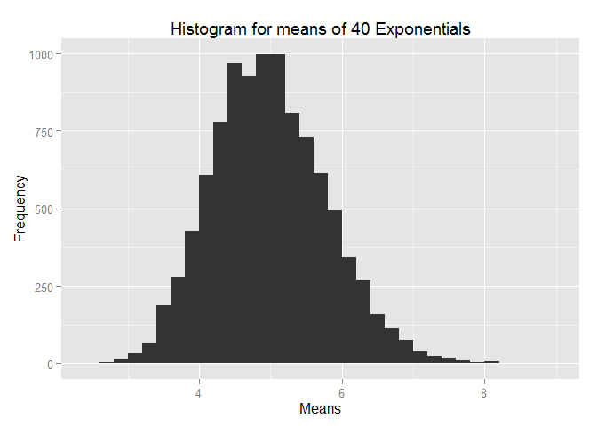

# Simulation of Exponential Distribution
authored by Gran Ville Lintao
June 22, 2015

## Overview
This is an exercise for comparing simulations of means of 40 exponentials with
the Central Limit Theorem. It is divided into 4 parts:  
1. The simulations performed  
2. The sample mean compared with the theoretical mean of the distribution  
3. The sample variance compared with the theoretical variance of the distribution  
4. An illustration via plot that shows the distribution is approximately normal  

## Simulations
Note that  
1. __n__, the number of exponentials per iteration for getting the mean is set to 40  
2. __lambda__, the rate parameter is set to 0.2  

The following code produces 10,000 means of 40 exponentials  


```r
n <- 40
lambda <- 0.2

mns = NULL
for (i in 1:10000)
  mns = c(mns, mean(rexp(n,lambda)))
```


## Sample Mean versus Theoretical Mean

After running the simulation, we can now get the sample mean in R by:

```r
# sample mean
meanS <- mean(mns)
meanS
```

```
## [1] 4.984079
```
Meanwhile, the theoretical mean of Exponential distribution can be calculated by:

```r
# theoretical mean
meanT = 1/lambda
meanT
```

```
## [1] 5
```

We can see the sample mean __meanS__ approximates the theoretical mean __meanT__ quite closely.
This means the distribution is centered at 4.9840792 and is very close to the theoretical mean 5.

## Sample Variance versus Theoretical Variance

Let's now calculate the sample variance. This can be done in R by:

```r
# sample variance
varS <- var(mns)
varS
```

```
## [1] 0.6396509
```

The theoretical variance on the other hand, is simply the standard deviation (1/lambda) squared over 
n samples

```r
# theoretical variance
varT <- (1/lambda)^2/n
varT
```

```
## [1] 0.625
```

Here we can also see that the sample variance __varS__ : 0.6396509 is very close to the theoretical variance __varT__ : 0.625.


## Distribution
By plotting the means using a simple histogram we can see quite clearly that the distribution is approximately normal.

This can be done in R using ggplot:

```r
library(ggplot2)
qplot(mns, geom="histogram",
      binwidth=0.2,
      xlab="Means", ylab="Frequency",
      main="Histogram for means of 40 Exponentials")
```

 


